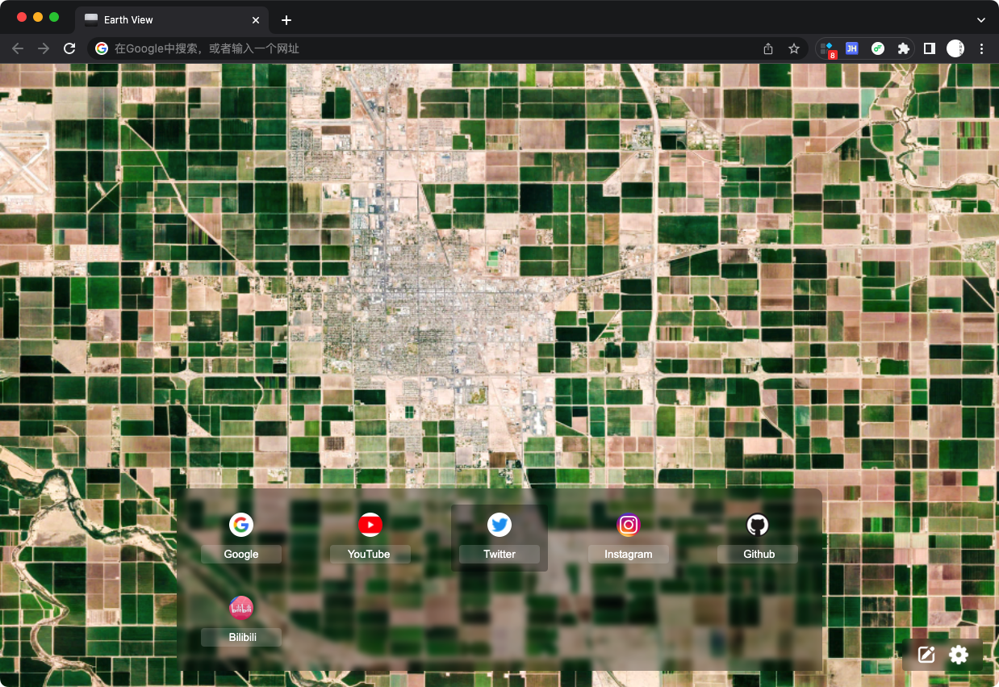

# Earth View

## 介绍
之前一直在用一个 Chrome 标签页扩展，叫：Earth View from Google Earth。功能很简单，就是每次打开标签随机会显示一张谷歌地球的照片。
但是这个扩展没有标签管理功能，所以我每次都是从书签栏进入的，但是有些书签藏得比较深，在二级升甚至三级目录，至于为什么不直接放一级，因为我嫌有些书签丑。
所以自己动手丰衣足食，照着差不多的写了一个：
1. 加上了展示书签功能，只展示你选择的书签，只有一级
2. 支持修改书签名称、拖拽排序
3. 书签区、设置区域鼠标 hover 才显示

## 安装

1. 下载代码，并解压
2. 将 `EarthView.crx` 改为 `EarthView.zip`
3. chrome 打开[扩展程序](chrome://extensions/)管理页面
4. 打开右上角开发者模式，将 `EarthView.zip` 拖入页面，安装完成

## 预览

